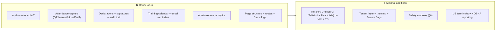
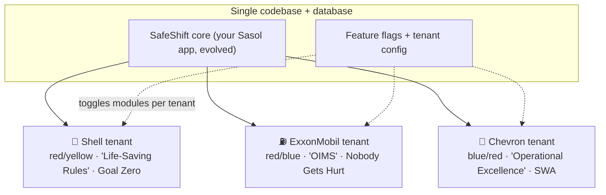
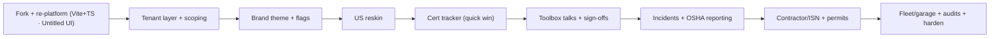

# 02 — **SafeShift** · Multi-Tenant HSE Training & Compliance

### *for Shell · ExxonMobil · Chevron* — one codebase, three brands

> Built by **reusing your `sasol-attendance` app** and giving it a minimal, high-leverage update: US oil & gas safety, US terminology, and a multi-tenant white-label layer so all three majors run on the same code with only minor per-company differences.

**Status:** Blueprint / not built yet · **Type:** Vibe-coding springboard · **Based on:** [github.com/michaelddmanuel/sasol-attendance](https://github.com/michaelddmanuel/sasol-attendance) · **Date:** 2026-06-16

> ⚠️ *Shell, ExxonMobil, Chevron and their safety-program names (Life-Saving Rules, OIMS, Operational Excellence, etc.) are real trademarks of their owners. This is a **white-label concept / demo** you'd pitch to or build for them — not an attempt to impersonate. See §16.*

---

## 0. TL;DR — the smart, minimal update

You already built a **Training Attendance & Compliance** app for Sasol (React + Express + Sequelize + Postgres). We **keep that core** and make four targeted changes:

1. **Multi-tenant white-label.** One codebase serves Shell, ExxonMobil, and Chevron as three "tenants," each with its own logo, colors, safety-program language, and **feature flags** — so they're ~90% the same app with the minor differences you'll dial in.
2. **US oil & gas reskin.** Swap South-African ESD/B-BBEE terminology for US HSE terminology and regulatory frameworks (OSHA, HAZWOPER, EPA, DOT).
3. **Bolt on safety modules.** Go beyond plain training attendance into the things refineries/terminals/fleets actually need — certification-expiry tracking, toolbox talks, permits-to-work, incident & near-miss reporting, contractor (ISNetworld) compliance, and **fleet/garage safety**. (Full menu in §8 — pick what you like.)
4. **Per-company feature matrix.** A simple on/off table (§10) decides which modules each brand gets. You tell me the toggles; the flags do the rest.

> ### ✅ Decisions locked (v1)
> - **Brand:** *SafeShift* with per-tenant lockups — **SafeShift Shell · SafeShift ExxonMobil · SafeShift Chevron** — plus a **3-way brand toggle** that switches the active brand/theme live (§6, §5.3).
> - **Styling:** **Untitled UI React** (Tailwind CSS v4 + React Aria) — *replacing Chakra UI* — on a **Vite + TypeScript** frontend.
> - **Garage:** **both** readings ship — fleet/vehicle maintenance **and** retail-station forecourt safety (§9).
> - **Audience:** employees **+ contractors** (adds ISN/Avetta site-access gating).
> - **v1 modules:** Cert & expiry tracker · Toolbox talks · Incident/near-miss + OSHA · Contractor compliance · Permit to Work · Stop Work Authority · SDS library · Fleet & garage · Audits & inspections.
> - **Mobile:** responsive web for v1 (an Expo app is a later phase).

---

## 1. The reframe — from Sasol ESD to US oil & gas HSE

| | **Existing (Sasol)** | **New (SafeShift)** |
|---|---|---|
| **Who** | Sasol ESD (Enterprise & Supplier Development) vendors | Shell / ExxonMobil / Chevron employees **+ contractors** |
| **Region** | South Africa (B-BBEE/ESD context) | United States (OSHA/EPA/DOT context) |
| **Core job** | Track training attendance + declaration forms + compliance | Same core **+** broader HSE safety compliance |
| **Tenancy** | Single org | **Multi-tenant**, 3 brands, feature-flagged |
| **"Vendor"** | Vendor representative | **Contractor** (US O&G term) |
| **"Declaration form"** | ESD declaration | **Attestation / sign-off** (Life-Saving Rules, OIMS, OE) |
| **Reporting** | ESD compliance insights | **OSHA-aligned** (300/300A logs, TRIR/DART), cert-expiry, contractor status |

**Why this is the smart move:** the hard parts you already solved — auth, roles, attendance capture (QR/manual/virtual/self-declared), digital declarations with signatures + IP/user-agent audit trail, training calendar, email reminders, admin reporting — are *exactly* the primitives HSE compliance needs. We're re-pointing them at a bigger, higher-value domain.

---

## 2. What you already have (the reusable core)

Captured straight from the repo so we're aligned on what we keep:

**Stack (current):** React 18 (CRA) · **Chakra UI** *(→ we'll swap for Untitled UI)* · React Router v6 · Context API auth · Formik + Yup · Axios · Framer Motion — and — Express · PostgreSQL · Sequelize · JWT · bcryptjs · Nodemailer · express-validator · Docker Compose · Vercel.

> The **backend is reused as-is** — that's where most of the solved complexity lives, so the "minimal update" promise holds on the server. The **frontend is a re-skin** (same pages, routes, Formik/Yup forms, and Axios services) onto **Untitled UI** — not a rewrite.

**Domain models:** `User` + `Role` (admin / esd_admin / vendor) · `Training` (schedule, location, virtual/meeting link, capacity, mandatory, status, facilitator) · `Attendance` (status, check-in/out, method = qr-code/manual/virtual/self-declared, verifiedBy/At) · `Declaration` (content, signature, IP, user-agent, isCompliant).

**Screens:** Auth (login/register/forgot/reset) · User (dashboard, training list/detail, attendance form, my attendance) · Admin (dashboard, training management, user management, reports & analytics).



---

## 3. The big idea — one codebase, three brands

Instead of forking the app three times (a maintenance nightmare), we make it **multi-tenant**. Each company is a *tenant* defined by config, not code:



- **Same features, minor differences** = feature flags. Turn a module on for Shell and off for Chevron with a config value, not a code branch.
- **Different look** = per-tenant theme (logo + colors + safety-program labels) loaded at runtime.
- **Isolated data** = every row is tenant-scoped (see §5).
- **One product, three skins** = it's all **SafeShift**, presented as **SafeShift Shell / SafeShift ExxonMobil / SafeShift Chevron**. A **3-way brand toggle** (for demos + platform admins) swaps the active Untitled UI theme live; real end-users stay pinned to their own tenant.

---

## 4. Tech stack — keep what works, add only what's needed

> Principle: **minimal update.** Same stack you know; small, surgical additions.

| Layer | Decision | Note |
|---|---|---|
| **Frontend** | 🔁 Migrate **Chakra → Untitled UI React** (Tailwind CSS v4 + React Aria) on **Vite + TypeScript** | Same pages/logic; swap the component library + build tool. Per-tenant theme via CSS-var tokens |
| **Routing/state** | ♻️ Keep React Router + Context | Add a `TenantContext` alongside `AuthContext` |
| **Backend** | ♻️ Keep Express + Sequelize + Postgres | Add `tenantId` scoping middleware + new models |
| **Auth** | ♻️ Keep JWT + bcrypt | Embed `tenantId` + richer roles in the token |
| **Email** | ♻️ Keep Nodemailer | Reuse for **cert-expiry** + permit/incident alerts |
| **Deploy** | ♻️ Keep Docker Compose + Vercel | Subdomain routing per tenant (shell./exxon./chevron.) |
| **➕ File storage** | Add S3-compatible (AWS S3 / Cloudflare R2 / Supabase Storage) | SDS PDFs, certs, incident photos, signed permits |
| **➕ QR / badge** | Add a QR lib (already have `qr-code` attendance method) | Site check-in + toolbox-talk sign-in |
| **➕ Background jobs** | Add `node-cron` (or BullMQ + Redis) | Nightly cert-expiry scan, reminder digests |
| **➕ PDF/CSV export** | Add `pdfkit`/`exceljs` | OSHA 300A, certificates, audit exports |
| **➕ Mobile (optional)** | Expo wrapper later | Field workers scan QR / report near-miss on phone |

> **Decided (your call):** modernize the frontend while we're in here — **CRA → Vite + TypeScript** and **Chakra → Untitled UI React** (Tailwind CSS v4 + React Aria). The backend (Express/Sequelize/Postgres) is reused **as-is**, so the "minimal update" still holds on the server; the frontend is a re-skin (same IA, routes, forms, API calls), not a rewrite.
>
> **Why Untitled UI fits:** it's open-code (you own the components, like shadcn), accessible by default via React Aria, and brand-themable purely through **Tailwind/CSS tokens** — which is exactly what white-labeling three brands needs.

---

## 5. Multi-tenant architecture (the heart of the update)

### 5.1 Tenant model & resolution
- New `Tenant` table: `id, slug (shell|exxon|chevron), displayName, theme(JSON), features(JSON), safetyProgramLabels(JSON)`.
- **Resolution order:** subdomain (`shell.safeshift.app`) → JWT `tenantId` → fallback. A `resolveTenant` middleware sets `req.tenantId` for every request.
- Every user belongs to exactly one tenant (`User.tenantId`).

### 5.2 Data isolation (defense in depth)
- **Every domain table gets `tenantId`** (FK → Tenant). A Sequelize **global scope / hook** auto-injects `where: { tenantId }` on reads and stamps it on writes — so app code can't accidentally leak across tenants.
- **Recommended hardening:** enable **Postgres Row-Level Security** so isolation is enforced at the DB even if app code has a bug. (Shared-DB-shared-schema is the simplest and matches your current setup; schema-per-tenant is an option if a customer demands physical separation.)

### 5.3 Theming (white-label look) — Untitled UI + Tailwind tokens
- Styling is **Untitled UI React** (built on **Tailwind CSS v4 + React Aria Components**). Brand theming is just **CSS variables / Tailwind theme tokens** — so white-labeling is clean and runtime-free.
- `Tenant.theme` holds `{ logoUrl, primary, secondary, accent }`. At load we set `data-tenant="shell|exxon|chevron"` on the root (or inject `--color-brand-*` CSS vars from the tenant record) — Shell renders red/yellow, Exxon red/blue, Chevron blue/red, with **zero component changes**.
- Untitled UI's neutral/semantic scales stay as the shared base; only the brand hues swap per tenant.
- **3-way brand toggle:** a header switcher flips `data-tenant` live → instant theme swap for demos and platform-admin preview.

### 5.4 Feature flags (the "minor differences")
```jsonc
// Tenant.features — example shape
{
  "toolboxTalks": true,
  "permitToWork": true,
  "incidentReporting": true,
  "contractorCompliance": true,   // ISNetworld/Avetta/Veriforce
  "fleetGarageSafety": false,     // the "garage" module
  "sdsLibrary": true,
  "auditsInspections": false,
  "stopWorkAuthority": true
}
```
- Frontend: a `<Feature flag="permitToWork">…</Feature>` gate + nav builder hides/shows modules.
- Backend: a `requireFeature('permitToWork')` middleware blocks routes for tenants without it (never trust the client).

### 5.5 Per-tenant safety language
- `Tenant.safetyProgramLabels` maps generic concepts → each brand's wording, e.g. `acknowledgement → "Life-Saving Rules sign-off"` (Shell) vs `"OIMS attestation"` (Exxon) vs `"OE / Tenets sign-off"` (Chevron). One component, three vocabularies.

---

## 6. Per-company branding & safety programs

> Approximate, widely-known brand colors + each major's real safety program. **Verify against each company's official brand guidelines before any real use.**

| | 🐚 **Shell** | ⛽ **ExxonMobil** | 🔷 **Chevron** |
|---|---|---|---|
| **Primary** | Shell Red `#DD1D21` | Exxon Red `#CE1126` | Chevron Blue `#0066B2` |
| **Secondary/accent** | Shell Yellow `#FBCE07` | Exxon Blue `#0054A4` | Chevron Red `#ED1C24` |
| **Safety program** | **Life-Saving Rules**, "Goal Zero" (HSSE) | **OIMS** (Operations Integrity Mgmt System), Loss Prevention System, "Nobody Gets Hurt" | **Operational Excellence (OE)**, "Tenets of Operation", **Stop Work Authority** |
| **Sign-off label** | "Life-Saving Rules acknowledgement" | "OIMS attestation" | "OE / Tenets sign-off" |
| **Vibe** | Bold, energetic | Corporate, precise | Trust, engineering-led |

This is exactly what `Tenant.theme` + `Tenant.safetyProgramLabels` encode.

**Brand lockup & toggle:** the app shows as **SafeShift {Brand}** — *SafeShift Shell*, *SafeShift ExxonMobil*, *SafeShift Chevron* — with the tenant logo beside the SafeShift mark. A **3-way toggle** in the top bar switches the active brand/theme live (Untitled UI tokens swap via `data-tenant`). End-users are pinned to their own tenant; platform admins and demo mode can flip freely between all three.

---

## 7. US terminology & spec mapping (ZA → US relabel)

A mostly **find-and-replace + dropdown-data** job, but it's what makes it feel native to a US oil & gas audience:

| Sasol / ZA | US oil & gas |
|---|---|
| ESD (Enterprise & Supplier Development) | **Contractor Safety Management** (supplier diversity is a separate thing in the US) |
| Vendor | **Contractor** / subcontractor |
| Declaration form | **Attestation / acknowledgement / sign-off** |
| "Compliance insights" | **OSHA / HSE compliance** (recordables, TRIR, DART) |
| Generic training | OSHA 10/30, **HAZWOPER** 40/24/8-hr, H2S, confined space, LOTO, fall protection |
| Date `DD/MM/YYYY` | **MM/DD/YYYY**; imperial units (ft, lbs, °F) |
| Phone / ID | **US phone format**, Employee ID / contractor ID, US states |
| "Training Center, Room 101" | **Refinery / terminal / field site / yard** naming |

---

## 8. 🔧 The Safety Module Menu — *ideas for you to pick from*

You asked for ideas on what makes sense. Here's the menu — each builds naturally on primitives you **already have** (attendance, declarations, reminders, reporting). Pick per company in §10.

> 🟢 = high value + low effort (reuses existing code) · 🟡 = medium · 🔴 = bigger build

1. **🟢 Certification & Competency Tracker** *(my #1 pick).* Track each worker's certs — OSHA 10/30, **HAZWOPER** (40-hr + 8-hr annual refresher), H2S Awareness, Confined Space, LOTO, Fall Protection, First Aid/CPR, forklift — with **expiry dates and automatic email/push alerts** before they lapse. Turns your "attendance" data into "are we *audit-ready right now?*" This is the single biggest upgrade over plain attendance.
2. **🟢 Toolbox Talks / Tailgate Meetings.** Daily pre-shift safety briefings with **digital sign-in** (QR or tap). This is literally your attendance feature re-skinned for the most common safety ritual in the field — replaces paper sign-in sheets.
3. **🟢 Document Acknowledgements / Sign-offs.** Your `Declaration` model, reused: workers attest to **Life-Saving Rules / OIMS / OE Tenets**, policies, JSAs — with signature + timestamp + IP audit trail you already capture.
4. **🟡 Incident & Near-Miss Reporting.** Report injuries, spills, unsafe conditions, near-misses (with photos). Auto-classify OSHA recordability and generate the **OSHA 300 log / 300A summary / 301 incident report**; track **TRIR / DART** rates on the admin dashboard.
5. **🟡 Stop Work Authority (SWA) log.** One-tap "I stopped unsafe work." Celebrate it (positive safety culture) and route for follow-up. A signature concept at all three majors.
6. **🟡 Safety Observations (BBS).** Quick "safe / at-risk behavior" observation cards — Chevron-style behavior-based safety, Shell "interventions." Feeds leading-indicator dashboards.
7. **🟡 Permit to Work (PTW).** Hot work, **confined space entry**, LOTO, excavation, line-breaking permits with an approval workflow, required-cert checks, and auto-expiry. High value at refineries/terminals.
8. **🟡 JSA / JHA (Job Safety/Hazard Analysis).** Build per-task hazard analyses, list controls, capture crew sign-off before work starts.
9. **🟡 Contractor Compliance (ISNetworld / Avetta / Veriforce).** Before a contractor gets **site access**, verify they're "ISN compliant" and their workers' certs are current. *Huge* in US O&G — gate the QR site check-in on it.
10. **🟢 Site Access / Orientation Check-in.** QR badge check-in/out at a gate; **SafeLandUSA / PEC** orientation tracking; visitor & contractor sign-in. (Extends your `qr-code` attendance method.)
11. **🟡 SDS Library (HazCom / GHS).** Searchable **Safety Data Sheets** per site/chemical, with "right-to-know" access for every worker.
12. **🟡 Audits & Inspections.** Scheduled site inspections with checklists, findings, photos, and **corrective actions (CAPA)** tracked to closure.
13. **🔴 Fleet & Garage Safety / Journey Management** *(your "garage" idea — see §9).*
14. **🟡 Emergency Drills & Mustering.** Log drill participation and **muster-point headcounts** — "is everyone accounted for?"
15. **🟢 PPE Issuance & Tracking.** Who's been issued what PPE; respirator **fit-test** records and expiries.

---

## 9. 🚗 The "garage" idea, fleshed out — Fleet & Garage Safety

You mentioned garage safety and weren't sure what fits — here's a concrete take. **Motor-vehicle incidents are one of the top causes of fatalities in oil & gas**, so a fleet/garage module is genuinely high-value. It splits into two halves:

**A) Driver / Journey safety (out on the road):**
- **Defensive Driving certs** (DDC/SafeLandUSA driving) tracked in the cert engine, with expiry alerts.
- **Vehicle pre-trip inspection** checklists (DOT-style) submitted from a phone before a journey.
- **Journey Management Plans** — for long/remote trips: route, check-in points, fatigue limits, lone-worker check-ins.
- **Driver eligibility gate** — can't be assigned a vehicle without current license + DDC + medical.

**B) Garage / maintenance-bay safety (in the shop):**
- **LOTO** (lockout/tagout) sign-offs for vehicle servicing.
- **Bay/equipment inspections** (lifts, jacks, ventilation) on a schedule with CAPA.
- **Hazardous materials** in the shop (oils, solvents) linked to the **SDS Library**.
- **Hot work / fire-watch permits** for welding/grinding in the bay.
- **Tool & PPE checks** for technicians.

**C) Retail forecourt safety (the service station) — ✅ you confirmed this is in too:**
- **Fuel-spill response** procedures + drills; forecourt slip/trip **inspections**.
- **Wet-stock / tank-gauging logs** and **underground-storage-tank (UST)** compliance checks.
- **Dispenser & canopy** equipment inspections; emergency-stop and fire-suppression checks.
- **Robbery / lone-worker / Stop-Work drills** for station staff.

> ✅ **You confirmed: both.** The Fleet & Garage module ships **all of A + B + C** — fleet/vehicle maintenance, journey/driver safety, **and** branded retail-forecourt safety.

---

## 10. Per-tenant feature matrix (you finalize the toggles)

My **recommended defaults** below — this is the "more or less the same, minor differences" dial. ✅ on · ⬜ off. **You'll tell me the final layout per company.**

| Module | 🐚 Shell | ⛽ ExxonMobil | 🔷 Chevron |
|---|:--:|:--:|:--:|
| Training attendance *(core)* | ✅ | ✅ | ✅ |
| Declarations / sign-offs *(core)* | ✅ | ✅ | ✅ |
| Certification & expiry tracker | ✅ | ✅ | ✅ |
| Toolbox talks | ✅ | ✅ | ✅ |
| Incident & near-miss + OSHA logs | ✅ | ✅ | ✅ |
| Stop Work Authority | ✅ | ⬜ | ✅ |
| Safety observations (BBS) | ⬜ | ✅ | ✅ |
| Permit to Work | ✅ | ✅ | ⬜ |
| Contractor compliance (ISN) | ✅ | ✅ | ✅ |
| SDS library | ✅ | ✅ | ⬜ |
| Audits & inspections | ⬜ | ✅ | ✅ |
| **Fleet & garage safety** | ⬜ | ⬜ | ✅ |
| Emergency drills & mustering | ✅ | ⬜ | ⬜ |

*(Illustrative — the differences above are just to show the mechanism. Replace with your real picks.)*

---

## 11. Data model — additions on top of your existing schema

Keep your current tables; add `tenantId` to all of them, plus these (only build the ones whose modules you switch on):

| New table | Key fields | Powers |
|---|---|---|
| `tenants` | slug, displayName, theme, features, safetyProgramLabels | Multi-tenancy + white-label |
| `sites` | tenantId, name, type(refinery/terminal/field/yard/station), address | Per-location scoping |
| `certifications` | userId, type, issuedAt, **expiresAt**, issuer, fileUrl, status | Cert/competency tracker + alerts |
| `course_catalog` | tenantId, code (OSHA30, HAZWOPER40…), validityMonths | What certs training grants |
| `toolbox_talks` | siteId, topic, date, facilitator → `toolbox_signins` | Daily briefings |
| `incidents` | siteId, type, severity, oshaRecordable, dartDays, photos[], status | Incident/near-miss + OSHA 300 |
| `stop_work_events` | userId, siteId, reason, resolution | SWA log |
| `permits` | type(hot-work/confined-space/LOTO), requiredCerts[], approvals[], expiresAt | Permit to Work |
| `jsas` | task, hazards[], controls[], signoffs[] | JSA/JHA |
| `contractors` | company, isnId, complianceStatus, expiresAt | ISN/Avetta gating |
| `sds_documents` | siteId, chemical, fileUrl, ghsClass | HazCom library |
| `inspections` | siteId, checklist, findings[], capa[] | Audits + corrective actions |
| `vehicles` / `journeys` / `pretrip_inspections` | … | Fleet & garage safety |
| `ppe_issuance` | userId, item, issuedAt, fitTestExpiry | PPE tracking |

---

## 12. Roles & permissions (US O&G flavor)

Replace `admin / esd_admin / vendor` with role set that fits the domain (still simple):

- **Platform Admin** — manages tenants, themes, feature flags (you).
- **HSE Manager** — full safety dashboard, OSHA reporting, audits (per tenant).
- **Supervisor / Person-in-Charge** — runs toolbox talks, approves permits, verifies attendance.
- **Worker / Employee** — attends training, signs off, reports near-miss, checks in.
- **Contractor** — like worker, but gated on **contractor compliance** before site access.
- **Auditor (read-only)** — regulators/internal audit: view logs + exports, no edits.

---

## 13. Compliance & reporting (the "insights" upgrade)

Your existing Reports & Analytics page, leveled up to what HSE leaders actually report:

- **Audit-readiness:** % workforce with current required certs; who's expiring in 30/60/90 days.
- **OSHA recordkeeping:** auto-built **300 log / 300A annual summary / 301**; **TRIR** and **DART** trend charts.
- **Leading indicators:** toolbox-talk participation, safety observations, near-miss count, SWA events.
- **Contractor status:** which contractors/crews are ISN-compliant and cleared for site.
- **Exports:** PDF certificates, CSV/Excel for regulators, signed-permit archives.

---

## 14. Migration / delta plan from `sasol-attendance` (minimal-update path)

Concrete, low-risk steps that reuse your repo:

1. **Branch & rename.** Fork the repo → `safeshift`. Global relabel Sasol → SafeShift; ESD → Contractor Safety; vendor → contractor.
2. **Re-platform the frontend.** CRA → **Vite + TypeScript**; replace **Chakra → Untitled UI React** (Tailwind CSS v4 + React Aria). Keep the same pages, routes, Formik/Yup forms, and Axios services — just swap the component layer. Backend untouched.
3. **Add the tenant layer.** New `Tenant` model + `tenantId` on all models (Sequelize migration) + `resolveTenant`/scoping middleware + `TenantContext` on the frontend.
4. **Brand theming + toggle.** Drive Untitled UI tokens from `Tenant.theme` via `data-tenant` CSS vars; add the **3-way brand switcher**. Seed Shell/Exxon/Chevron themes + logos.
5. **Feature flags.** Add `Tenant.features` + `<Feature>` gate + `requireFeature` middleware; wire the nav to flags.
6. **US reskin.** Swap terminology, date/unit formats, dropdown data (states, cert types, site types).
7. **Ship module 1 — Cert tracker.** Highest value, smallest build (it's `Training` + `expiresAt` + a nightly `node-cron` alert job reusing Nodemailer).
8. **Layer in the rest of the v1 modules** per the feature matrix, one at a time (toolbox talks → incident/OSHA → contractor/ISN → permits → SWA → SDS → fleet/garage → audits).
9. **Harden.** Add Postgres RLS, S3 storage for files, OSHA export jobs.



---

## 15. Roadmap (phased)

| Phase | Ships | Why now |
|---|---|---|
| **0 · Foundation** | Fork, **re-platform (Vite + TS, Untitled UI)**, tenant model, scoping, brand theme + toggle, flags, US reskin | Unlocks 3 brands from one codebase |
| **1 · Audit-readiness** | Cert & expiry tracker, toolbox talks, sign-offs | Biggest value, reuses existing code |
| **2 · Incidents & OSHA** | Incident/near-miss, OSHA 300/300A, TRIR/DART, SWA | The compliance backbone |
| **3 · Access & contractors** | QR site check-in, ISN/Avetta gating, permits, JSA | Controls who works, safely |
| **4 · Fleet & garage** | Journey mgmt, pre-trip, garage LOTO/inspections | Your "garage" idea |
| **5 · Depth & polish** | SDS library, audits/CAPA, mustering, PPE, exports, mobile wrapper | Rounds out HSE suite |

---

## 16. Security, privacy & the trademark/legal reality check

- **Trademarks:** Shell/Exxon/Chevron names, logos, and safety-program names are **their property**. This blueprint is a **white-label product concept** (the kind of thing you'd build *for* them or demo *to* them), not a way to pose as them. Use placeholder brands for any public demo.
- **Tenant isolation is security-critical.** Every table tenant-scoped; **Postgres RLS** as a backstop; tests that prove tenant A can't read tenant B. (Cross-tenant data leakage is the #1 multi-tenant risk.)
- **Sensitive data:** worker certs, medicals, incident details, possibly injury health info → encrypt at rest, least-privilege access, audit every read. Keep PII minimal (employee ID over SSN; if SSN ever needed, store last-4 only, encrypted).
- **OSHA records** have legal retention requirements — treat incident/300-log data as records of authority (immutable audit trail, you already log IP/user-agent/signature).
- **OWASP baseline:** authz on every route (don't trust client flags), input validation (you have express-validator), file-upload scanning for SDS/incident photos, signed URLs for storage, rate limiting, secrets server-side only.

---

## 17. My recommendations (if I were you)

- **Build the tenant layer + theming + flags first** — it's the whole point and it's a small, well-contained change to your existing app.
- **Lead with the Certification & Expiry Tracker** (§8.1). Highest ROI, smallest build, and it instantly makes the app feel "enterprise HSE" instead of "attendance."
- **Make all three share the same core 6 modules**, and use the *differences* for flavor: e.g. Chevron gets **Fleet/Garage** + **SWA**, Exxon gets **BBS observations** + **Audits**, Shell gets **Mustering** + **Permits**. (Illustrative — your call.)
- **Confirmed: garage = both** — fleet/journey safety **and** retail forecourt safety both ship in the Fleet & Garage module.
- **Keep the backend, re-skin the frontend.** Reuse Express/Sequelize/Postgres as-is; migrate the React frontend to **Untitled UI React on Vite + TypeScript**. Not a rewrite — same IA, routes, and API calls.

---

## 18. Decisions locked & what's still open

**✅ Locked for v1:**
- **Brand:** SafeShift, per-tenant lockups (SafeShift Shell / ExxonMobil / Chevron) + a 3-way brand toggle
- **Styling:** Untitled UI React (Tailwind v4 + React Aria), **replacing Chakra**, on Vite + TypeScript
- **Garage:** both — fleet/journey safety **and** retail forecourt safety
- **Audience:** employees + contractors (ISN/Avetta gating)
- **Mobile:** responsive web for v1 (Expo app later)
- **v1 modules:** Cert & expiry tracker · Toolbox talks · Incident/OSHA · Contractor compliance · Permit to Work · Stop Work Authority · SDS library · Fleet & garage · Audits & inspections

**❓ Still open (need your call):**
1. **Per-tenant feature matrix (§10):** every v1 module gets *built* — but which are switched **on per company**? Give me the real Shell / Exxon / Chevron on-off picks, or I'll default to "all on, identical."
2. **Tenant isolation:** shared DB with `tenantId` + Postgres RLS (simplest, recommended) — or does any brand need a physically separate database?
3. **Untitled UI tier:** the **free open-code** Untitled UI React components, or the **PRO** kit (more components + page templates)?

---

*Answer the three open items and I'll lock the spec + per-tenant matrix. Or send the next idea and I'll spin up `03 — …`.*
